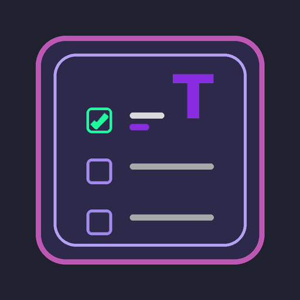
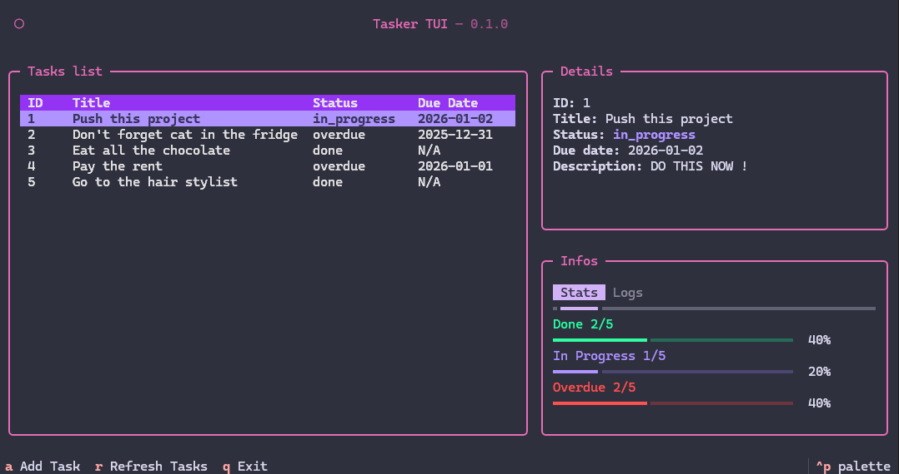
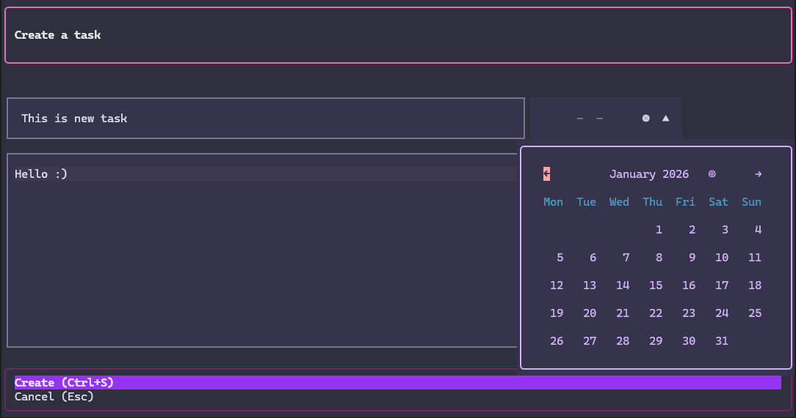
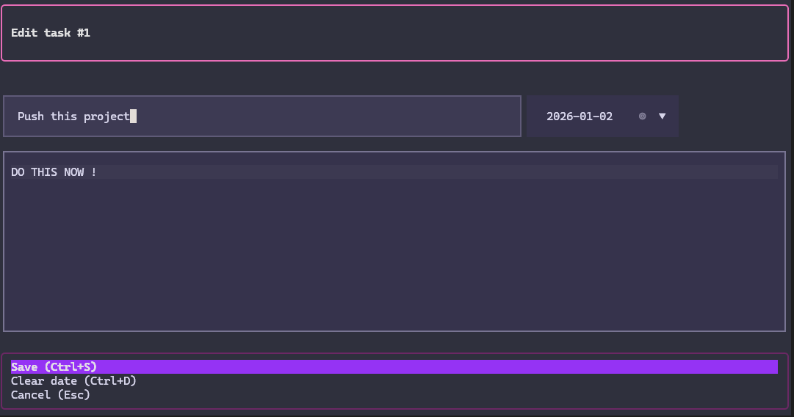
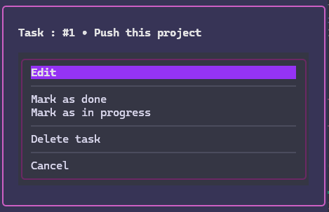

<div align="center">
  
  
  # TUI-Tasker
  
  **A modern task manager with Terminal User Interface and REST API**
  
  Built with Python, Textual, and FastAPI
  
  [](https://opensource.org/licenses/MIT)
  [](https://www.python.org/)
  
</div>

---

##  Features

### TUI
- Create, edit, delete tasks
- Mark as done or in progress
- Due dates with automatic overdue detection
- Visual statistics (progress bars)
- Real-time activity log
- Keyboard and mouse navigation

### REST API
- Full CRUD (`GET`, `POST`, `PATCH`, `DELETE`)
- Secured by API Key
- Auto documentation (Swagger)
- Data validation (Pydantic)

### Business logic
- Hexagonal architecture
- Validation: title max 30 chars, description max 115 chars
- 3 statuses: `IN_PROGRESS`, `DONE`, `OVERDUE`
- Automatic notifications (notifications.txt)
- SQLite database

---

##  Images

- **Main screen**  


- **Create task**  


- **Edit task**  


- **Actions menu**  


---

##  Installation

### User mode
```bash
poetry install
```

### Dev mode
```bash
poetry install --with dev
```

---

##  Usage

### Launch TUI
```bash
poetry run python -m todo.adapters.tui.app
```

### Launch API
```bash
# Create a .env file at the root
echo "API_KEY=your-secret-key-here" > .env

# Start the server
poetry run uvicorn todo.adapters.api.api:app --reload

# Access Swagger documentation
# http://localhost:8000/docs
# (Don't forget to set the API key in the top right if you want to test endpoints on the doc)
```

### Tests
```bash
# All tests
poetry run pytest

# With details
poetry run pytest -v
```

### Test API

##### With Bruno (provided collection)
```bash
cd bruno-coll/TUI-tasker
# Open with Bruno Desktop (don't forget to configure the API Key in the collection Headers)
```

---

##  Dependencies

### Production

| Package | Role |
|---------|------|
| **sqlalchemy** | ORM for SQLite |
| **fastapi** | REST API framework |
| **pydantic** | Data validation |
| **uvicorn** | Server to run FastAPI |
| **rich** | Terminal rendering (used by Textual) |
| **textual** | Modern TUI framework |
| **textual-timepiece** | DatePicker widget for Textual |
| **python-dotenv** | Environment variables management (.env) |

### Development

| Package | Role |
|---------|------|
| **textual-dev** | Textual DevTools (debug console, reload) |
| **pytest** | Unit testing framework |
| **pytest-cov** | Test code coverage |

---

##  Design & Technical choices

### Why Textual?
- **Inspiration**: **Posting** application briefly seen in class and which uses textual.
- **Advantages**:
  - Modern framework based on Rich
  - CSS-like for styling
  - Widgets (DataTable, ProgressBar, TabbedContent)
  - Live reload in dev
  - Good documentation: [Textual Docs](https://textual.textualize.io/)

### Color palette
> Also inspired by the posting theme.

**Textual theme**: Rose Pine Moon

| Color | Hex | Usage |
|---------|-----|-------|
| **Background** | `#20212f` | Background |
| **Primary** | `#d563a8` | Headers, borders, titles |
| **Secondary** | `#9775DC` | Accents, highlights |
| **Violet** | `#892DE1` | Table headers, scrollbars |
| **Success** | `#1EFB9D` | Completed tasks |
| **Warning** | `#A187F0` | In progress tasks |
| **Error** | `#FC4949` | Overdue tasks |

---

##  Architecture

### Hexagonal (Ports & Adapters)

```
src/todo/
├── domain/              # Business entities (Task)
├── application/         # Use cases + Ports (interfaces)
└── adapters/            # Implementations
    ├── api/             # REST Adapter (FastAPI)
    ├── tui/             # Terminal Adapter (Textual)
    ├── persistence/     # SQLite Adapter
    └── notifications/   # Notifications file Adapter
```

### Project structure

```
tui-tasker/
├── src/todo/                    # Source code
│   ├── domain/                  # Entities (Task, TaskStatus)
│   ├── application/             # Use cases (business logic)
│   └── adapters/                # Interfaces (API, TUI, DB)
├── tests/                       # Unit tests
│   └── test_use_cases.py        # Business logic tests
├── bruno-coll/                  # Bruno collection (API tests)
├── .env                         # Environment variables (API_KEY)
├── pyproject.toml               # Poetry configuration
├── todo.db                      # SQLite database (auto-created)
└── notifications.txt            # Action log (auto-created)
```

---

##  Security

- **API Key**: Simple protection for external access
- **Validation**: Pydantic + use cases to prevent invalid data

---

##  TUI Shortcuts

| Key | Action |
|--------|--------|
| `a` | Add a task |
| `r` | Refresh the list |
| `Enter` | Open actions menu |
| `Ctrl+S` | Save (in modals) |
| `Ctrl+D` | Clear date (editing) |
| `Escape` | Cancel |
| `q` | Quit |
| `ctrl+p` | Open textual panel |

---

##   Future improvements

- **JWT Authentication**: Replace simple API Key with JWT tokens for better security
- **User management**: Add user registration, login, and task ownership
- **Task sharing**: Enable collaboration between users
- **Priority levels**: Add task prioritization (low, medium, high)

---

##  Author

This project was built by [Kylian Project](https://github.com/Kylian-Project)

---

##  License

This project is licensed under the [MIT License](https://opensource.org/licenses/MIT).

---

##  Resources

- [Textual Documentation](https://textual.textualize.io/)
- [FastAPI Documentation](https://fastapi.tiangolo.com/)
- [Rose Pine Theme](https://rosepinetheme.com/)
- [Posting (inspiration)](https://github.com/darrenburns/posting)

---

<div align="center">Built with ❤️ by Kylian Project</div>